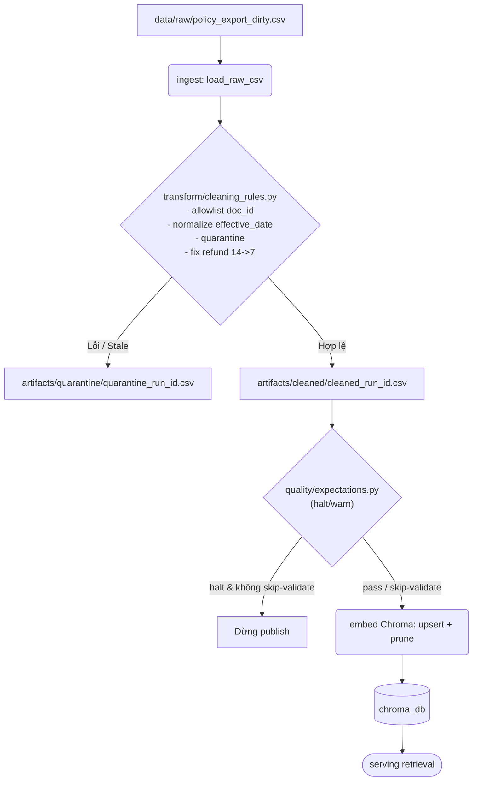

# Kiến trúc pipeline — Lab Day 10

**Nhóm:** C401_B4  
**Cập nhật:** 15/04/2026

---

## 1. Sơ đồ luồng (bắt buộc có 1 diagram: Mermaid / ASCII)

Telemetry/lineage:
- artifacts/logs/run_<run_id>.log
- artifacts/manifests/manifest_<run_id>.json
- freshness check đọc manifest (latest_exported_at, SLA giờ)

Ghi chú quan sát vận hành:
- `run_id` xuất hiện trong log, manifest, metadata vector và tên file artifacts.
- Freshness được đo sau khi ghi manifest (theo `latest_exported_at`, fallback `run_timestamp`).
- Quarantine là ranh giới publish: bản ghi lỗi không đi vào cleaned/embed.

---

## 2. Ranh giới trách nhiệm

| Thành phần | Input | Output | Owner nhóm |
|------------|-------|--------|--------------|
| Ingest | `data/raw/*.csv` | Danh sách row thô trong bộ nhớ + log `raw_records` | Ingestion Owner |
| Transform | Row thô + rule clean | `cleaned_<run_id>.csv` và `quarantine_<run_id>.csv` | Cleaning/Quality Owner |
| Quality | Cleaned rows | Kết quả expectation (`warn`/`halt`) + quyết định dừng/đi tiếp | Cleaning/Quality Owner |
| Embed | Cleaned CSV đã qua validate | Upsert vào Chroma + prune id cũ + metadata `run_id` | Embed Owner |
| Monitor | Manifest + SLA | Trạng thái PASS/WARN/FAIL freshness + cảnh báo vận hành | Monitoring/Docs Owner |

---

## 3. Idempotency & rerun

Chiến lược idempotent hiện tại:

- Mỗi chunk được tính giá trị `chunk_id` ổn định qua hàm hash từ chuỗi kết hợp `doc_id + chunk_text + seq`. 
- Thao tác ghi dữ liệu vào Chroma dùng lệnh `upsert(ids=chunk_id)`. Rerun 2 hoặc n lần trên cùng dữ liệu sẽ không bao giờ sinh ra duplicate vector.
- Trước khi upsert, pipeline có cơ chế **prune snapshot**: nó truy vấn tất cả id đang tồn tại trong collection, đối chiếu với id của batch cleaned hiện tại, và xóa (delete) những vector id cũ không còn tồn tại. Điều này ngăn chặn triệt để hiện tượng tàn dư của dữ liệu cũ (ví dụ luật hoàn tiền 14 ngày đã xóa) kẹt lại trong vector store.

---

## 4. Liên hệ Day 09

Liên hệ vận hành với Day 09:

- Day 10 chuẩn hóa tầng dữ liệu để retrieval ổn định trước khi agent orchestration dùng kết quả tìm kiếm.
- Canonical policy vẫn đi từ bộ docs nghiệp vụ CS + IT Helpdesk; Day 10 bổ sung lớp ingest/clean/validate trước khi embed.
- Khi rerun Day 10 thành công, collection Chroma được cập nhật theo snapshot mới, từ đó Day 09 retrieval nhận context đúng version (ví dụ refund 7 ngày, không dính chunk stale 14 ngày).

---

## 5. Rủi ro đã biết

- **Lạm dụng `--skip-validate`:** Như chứng minh qua lần chạy `sprint3-inject-bad`, việc bypass luồng lỗi (`halt`) sẽ trực tiếp nhồi văn bản lạc hậu (cửa sổ 14 ngày) vào vector database, làm gãy quá trình retrieval (câu tìm bị false positives `hits_forbidden`).
- **Trễ Freshness SLA:** Ngày giờ `latest_exported_at` bị thiếu hoặc vượt mốc quy định (VD: 120 giờ >> 24 giờ), pipeline vẫn embed nên kết quả context trả ra agent rất rủi ro.
- **Biến động raw format (`doc_id` mới):** CSV nguồn xuất hiện tài liệu không nằm trong danh sách khai báo trước (allowlist document) sẽ bị chặn ngoài `quarantine` hoàn toàn. Trừ khi cập nhật code cleaning và data_contract song song.
- **XSS, chunk rác:** Hiện nay đã thêm rules trong `cleaning_rules.py` ngăn HTML và đoạn chữ quá ngắn, nhưng rủi ro format dị thường trong text vẫn khó tránh hết, cần thêm kiểm thử độ dài nâng cao.
